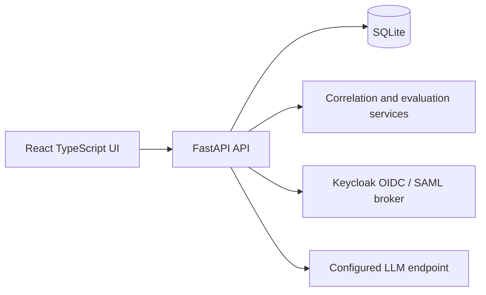

# Threat Intel Analyzer — Alan Vo | AI & Machine Learning

A threat intelligence workbench for security analysts: import vulnerability records, correlate affected package versions against assets, prioritize findings, and generate briefings. A deterministic weighted keyword classifier and evaluation harness provide an offline baseline for threat categorization. Optional LLM explanations use an interchangeable server-side API adapter.

## Architecture



## Local installation

Requires Python 3.12 and Node.js 24. Run from the repository root:

```bash
python3 -m venv .venv
.venv/bin/pip install -r backend/requirements.txt
cd frontend
npm ci
cd ..
```

For an explicitly local demonstration, start the backend:

```bash
ENVIRONMENT=development DEMO_MODE=true PYTHONPATH=backend .venv/bin/uvicorn app.main:app --host 127.0.0.1 --port 8000
```

In another terminal, run `npm run dev --prefix frontend` and open http://127.0.0.1:3000. Demo login is for local testing only. The app seeds illustrative vulnerability and asset records; these are fixtures, not a live intelligence feed.

## Workflows and API reference

Interactive request/response schemas are available at http://127.0.0.1:8000/docs. Data routes require an authenticated session. Cookie-authenticated mutations use the CSRF mechanism.

| Route (under `/api/v1`) | Purpose |
| --- | --- |
| `/auth/login`, `/auth/callback`, `/auth/me`, `/auth/logout` | SSO session lifecycle |
| `/vulnerabilities`, `/vulnerabilities/import` | Browse, create and import vulnerability records |
| `/vulnerabilities/extract-iocs` | Extract indicators from text |
| `/assets`, `/assets/{asset_id}` | Manage asset inventory |
| `/scans/run`, `/scans`, `/scans/{scan_id}/export` | Correlate assets and export findings |
| `/briefings/generate`, `/briefings/{briefing_id}/advisory` | Generate briefings and optional advisory explanations |
| `/briefings/{briefing_id}/export-markdown` | Export a Markdown briefing |
| `/audit` | Inspect recorded actions |

See the live OpenAPI schema for exact methods and payloads. `/healthz` is the health endpoint.

## AI/ML evaluation

```bash
PYTHONPATH=backend .venv/bin/python -c 'import json; from app.services.ml_eval import AgentEvaluator; print(json.dumps(AgentEvaluator.evaluate_classifier(), indent=2))'
PYTHONPATH=backend .venv/bin/python -m pytest backend/tests -q
npm run build --prefix frontend
npm test --prefix frontend -- --run
```

The evaluation dataset is the 12 hand-authored CVE summaries in `backend/app/services/ml_eval.py`. Labels are illustrative and need independent review. The classifier sums fixed lexical weights; it is not a trained model or a TF-IDF implementation. Evaluation reports accuracy and per-category/macro F1 on that small fixture set, not held-out generalization. Unknown terms, ambiguity and paraphrases can change predictions. The advisory grounding score measures literal phrase coverage and does not establish factual correctness.

## Provider configuration

| Variable | Meaning |
| --- | --- |
| `LLM_API_KEY` | Optional server-side LLM credential |
| `LLM_PROVIDER` | Adapter: `openai-compatible`, `anthropic`, `gemini`, or `ollama` |
| `LLM_BASE_URL` | Operator-selected endpoint |
| `LLM_MODEL` | Model identifier exposed by the endpoint |

Choose the adapter, URL and model appropriate to your service. No single vendor is required. Keep credentials out of source control and the browser. Offline correlation and evaluation do not require an LLM key.

## SSO and SAML

The backend uses OIDC with Keycloak; SAML authentication is handled by Keycloak identity brokering. Configure `OIDC_ISSUER`, `OIDC_CLIENT_ID`, `OIDC_CLIENT_SECRET` and `OIDC_REDIRECT_URI`, and map viewer/analyst/admin roles. The realm import is in `keycloak/realm-export.json`; see [the SAML setup guide](docs/saml_sso_guide.md). Browser and backend must reach the same configured issuer.

## Containers and deployment limitations

Dockerfiles and `compose.yaml` are included for development. Build with `docker compose build`. The current Compose settings contain development credentials and internal-only issuer addressing; they require correction before a usable SSO deployment. Do not expose this configuration publicly. Production requires HTTPS, operator-provided secrets, secure cookies, reviewed session settings and verified IdP integration. Demo mode is rejected when `ENVIRONMENT=production`.

SQLite holds application data. Stop writes before copying the database, keep encrypted backups outside the container, and verify restoration into a separate instance. No production audit, live-feed coverage or enterprise certification is claimed.

## License and author

MIT — see [LICENSE](LICENSE).

Alan Vo · [GitHub](https://github.com/ALANDVO) · [alanvo@gmail.com](mailto:alanvo@gmail.com)
