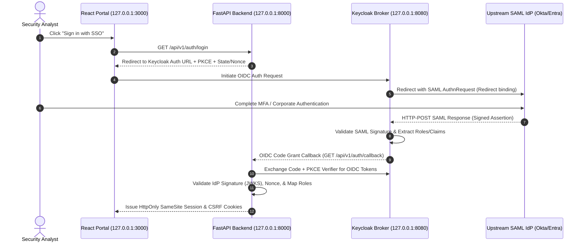

# SAML 2.0 Single Sign-On Configuration Guide (via Keycloak Identity Broker)

## Architectural Overview
`threat-intel-analyzer-alan-vo` delegates user authentication to **Keycloak (24.0+)** via standard **OpenID Connect (OIDC)** authorization-code flow with **PKCE (RFC 7636)**.

Rather than implementing a fragile, error-prone custom SAML service provider in Python, Keycloak acts as an enterprise **Identity Broker**. Keycloak terminates incoming SAML 2.0 assertions from corporate Identity Providers (Okta, Microsoft Entra ID / Azure AD, PingFederate, Google Workspace, Shibboleth) and translates them into cryptographically signed OIDC tokens with mapped roles (`admin`, `analyst`, `viewer`).



---

## 1. Upstream SAML Identity Provider Configuration

### Service Provider (SP) Metadata
Configure your upstream enterprise SAML IdP with the following values:
- **Entity ID / Audience URI**:
  `http://127.0.0.1:8080/realms/threat-intel`
- **Single Sign-On URL (ACS / Assertion Consumer Service)**:
  `http://127.0.0.1:8080/realms/threat-intel/broker/enterprise-saml-idp/endpoint`
- **Binding**: `HTTP-POST`
- **NameID Format**: `EmailAddress` (`urn:oasis:names:tc:SAML:1.1:nameid-format:emailAddress`)
- **Signature Algorithm**: `RSA_SHA256`

### Attribute Statements
Configure the SAML IdP to release the following user attributes in the assertion:
| SAML Attribute Name | Format | Target Mapping |
| :--- | :--- | :--- |
| `email` | `Basic` / `URI` | User Email |
| `firstName` | `Basic` | Given Name |
| `lastName` | `Basic` | Surname |
| `roles` / `groups` | `Basic` | Security Roles (`admin`, `analyst`, `viewer`) |

---

## 2. Keycloak Realm Import & Brokering Setup

The repository includes a ready-to-use realm export in [`keycloak/realm-export.json`](file:///var/lib/alan-portfolio/work/threat-intel-analyzer-alan-vo/keycloak/realm-export.json).

### Steps to Import:
1. Start Keycloak with the import flag:
   ```bash
   docker compose up -d keycloak
   ```
2. Navigate to Keycloak Admin Console at `http://127.0.0.1:8080` (credentials: `admin` / `admin_dev_password`).
3. Under the `threat-intel` realm, open **Identity Providers** -> **enterprise-saml-idp**.
4. In **SAML Settings**:
   - Set **Single Sign-On Service URL** to your corporate IdP's SSO URL.
   - Upload your IdP's X.509 Signing Certificate into **Signing Certificate**.
   - Toggle **Enabled** to `ON`.
5. Under **Mappers**, add a **SAML Attribute to Role** mapper:
   - Attribute Name: `roles`
   - Map `Security-Admins` -> `admin`
   - Map `Security-Analysts` -> `analyst`
   - Map `*` -> `viewer` (default fallback)

---

## 3. Production Hardening & Reverse Proxy Requirements
1. **Enforce HTTPS (TLS 1.3)**:
   Keycloak requires TLS (`sslRequired: "all"`) when accessed outside localhost. Terminate TLS on an enterprise reverse proxy (e.g. NGINX, Traefik, Envoy, or AWS ALB).
2. **Clock Skew Toleration**:
   Ensure NTP is synchronized across the backend host and SAML IdP. Default clock skew tolerance is 120 seconds.
3. **Session Hardening**:
   All issued sessions use `HttpOnly`, `SameSite=Lax` (or `Strict`), and `Secure=True` in production. Mutating requests require cryptographic `X-CSRF-Token` headers.
